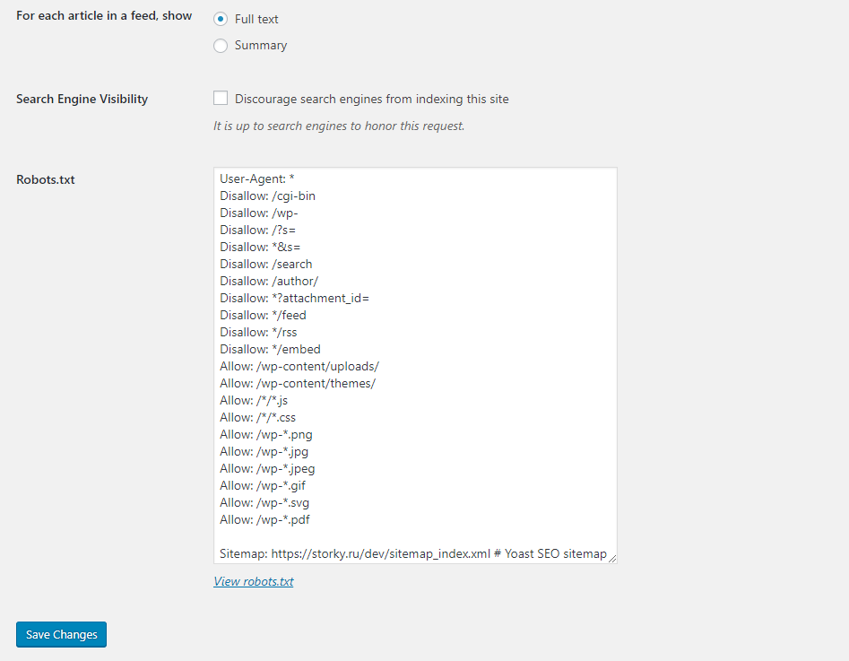

#Robots.txt 

Description:
== Description ==

The plugin allows you to create and edit the robots.txt file on your site.

1. Robots.txt settings

== Installation ==
1. Upload the plugin folder into the `wp-content/plugins/` directory of your WordPress site.
1. Activate `Robots.txt` from Plugins page
1. Add to nginx config:
~~~
location = /robots.txt {
    rewrite ^/(.*)$ /index.php?robots=1 last;
}
~~~
1. You can change robots along the way `Settings > Reading`